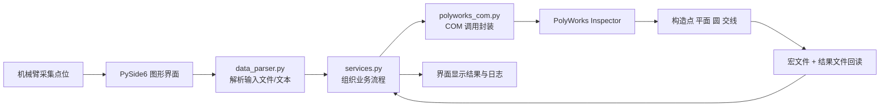

> 目录已重构：当前源码集中存放在 `polyworks_robot_arm/` 包目录下。  
> 结构说明见 [`docs/PROJECT_STRUCTURE.md`](docs/PROJECT_STRUCTURE.md)。  
> 启动方式保持不变：`python main.py`、`python robot_simulator.py`
# PolyWorks 机械臂测量接口

<div align="center">


一个面向机械臂测量场景的桌面工具，用 Python 图形界面连接 PolyWorks Inspector，完成点导入、几何构造、结果回读与展示。

</div>

## 项目简介

这个项目把机械臂采集到的空间点坐标送入 PolyWorks，由 PolyWorks 完成几何特征构造与参数计算，再把结果回传到 Python 界面中显示。  
整体思路不是在本地重复实现全部工业几何算法，而是复用 PolyWorks 的测量与构造能力，让结果更贴近真实工程流程。

当前项目已经实现 3 个核心功能：

- 三平面交点
- 多点拟合圆
- 两面交线

## 核心功能

| 功能 | 输入 | 输出 |
| --- | --- | --- |
| 三平面交点 | 9 个点，按 `顶部 / 正面 / 侧面` 每组 3 点 | 三个平面的交点坐标 `(X, Y, Z)` |
| 拟合圆 | 至少 3 个空间点 | 圆心、直径、法向量 |
| 两面交线 | 两组点，每组至少 3 点 | 交线上的一点、方向向量 |

## 工作流程图



## 项目亮点

- 真实工程链路：核心几何结果由 PolyWorks 计算，避免本地算法和工程软件结果不一致。
- 界面清晰：使用 `PySide6` 搭建桌面界面，操作路径直观，适合现场使用。
- 模块分层明确：界面层、业务层、通信层、数据层职责分离，便于维护和扩展。
- 支持示例数据：仓库自带 `数据文件` 目录，便于快速演示与调试。
- 结构更聚焦：项目计算流程统一走 PolyWorks，不再保留未参与主流程的本地几何计算模块。

## 界面功能说明

### 1. 三平面交点

- 从文本文件读取 9 个点坐标
- 按 3 组点分别构造 3 个平面
- 在 PolyWorks 中求三平面的交点
- 将结果显示在界面结果区

### 2. 拟合圆

- 支持直接粘贴多行点坐标，或从文件导入
- 在 PolyWorks 中根据点集拟合圆
- 返回圆心、直径和法向量

### 3. 两面交线

- 分别输入两个平面的点集
- 先构造两个最佳拟合平面
- 再计算两个平面的交线
- 返回交线上的一点和方向向量

## 项目结构

```text
robot-arm project/
├─ main.py                 # 程序入口
├─ ui_main_window.py       # 主窗口与 3 个功能页
├─ services.py             # 业务流程编排
├─ polyworks_com.py        # PolyWorks COM 通信封装
├─ data_parser.py          # 点坐标文本/文件解析
├─ result_types.py         # 测量结果数据结构
├─ config.py               # 全局配置与常量
├─ 数据文件/               # 示例输入数据
└─ 项目交付文档.md         # 交付说明文档
```

## 环境要求

- Windows 系统
- 已安装 PolyWorks Inspector
- Python 3.x

建议安装以下依赖：

```bash
pip install PySide6 comtypes
```

## 快速开始

### 1. 克隆项目

```bash
git clone <your-repo-url>
cd <your-repo-folder>
```

### 2. 安装依赖

```bash
pip install PySide6 comtypes
```

### 3. 启动程序

```bash
python main.py
```

### 4. 使用流程

1. 打开 PolyWorks Inspector
2. 启动本程序
3. 点击“连接 PolyWorks”
4. 进入对应功能页
5. 导入点坐标或粘贴点数据
6. 点击计算并查看结果

## 输入数据格式

支持以下格式：

```text
x,y,z
```

或：

```text
x y z
```

也兼容：

```text
x;y;z
```

说明：

- 每行表示一个点
- 支持空行
- 支持以 `#` 开头的注释行

示例：

```text
# 平面点
0.0, 0.0, 0.0
10.0, 0.0, 0.0
5.0, 5.0, 0.0
0.0, 10.0, 0.0
```

## 示例数据

仓库内已提供示例点位文件：

- `数据文件/平面交点.txt`
- `数据文件/拟合圆.txt`
- `数据文件/平面1.txt`
- `数据文件/平面2.txt`

你可以直接用这些文件验证程序流程。

## 结果回读机制

这个项目的一个关键点，是把 PolyWorks 的计算结果回传给 Python：

1. Python 动态生成临时 `.pwmacro` 宏文件
2. PolyWorks 执行宏命令
3. 宏把计算结果写入临时 `.txt` 文件
4. Python 读取结果文件并解析
5. 最终将结果显示在 GUI 中

这种做法的好处是：

- 计算结果直接来自 PolyWorks
- Python 端逻辑更清晰
- 后续扩展其他几何特征时更容易复用

## 配置说明

项目中的一些关键配置集中在 `config.py`：

- 窗口标题、尺寸、字体
- 各功能最少点数要求
- PolyWorks 中创建对象的命名规则
- 临时结果文件与宏文件路径

默认临时文件路径为：

```text
D:/polyworks_temp_result.txt
D:/pw_get_point.pwmacro
```

如果你的环境不适合写入 `D:` 盘，可以在 `config.py` 中自行调整。

## 技术架构

| 层级 | 说明 |
| --- | --- |
| UI 层 | `ui_main_window.py`，负责界面展示、用户输入和日志输出 |
| 业务层 | `services.py`，负责将功能拆解为 PolyWorks 操作步骤 |
| 通信层 | `polyworks_com.py`，负责 COM 连接与命令执行 |
| 数据层 | `data_parser.py`、`result_types.py`、`config.py` |

## 适用场景

- 机械臂测量点位导入与几何求解
- 孔位中心定位
- 平面交线提取
- 工件边界/边线识别
- 为插孔、对中、打磨、检测等任务提供几何参考

## 后续可扩展方向

- 结果导出为文本或 Excel
- 历史任务记录与批处理
- 自动清理 PolyWorks 中间对象
- 增加更多特征类型，例如球、圆柱、夹角等
- 增强异常处理，例如重复点、近似平行平面等场景

## 仓库说明

这个仓库更适合作为一个面向工程应用的原型或交付版本，适合继续沿着以下方向完善：

- 增加 `requirements.txt`
- 增加界面截图或演示 GIF
- 增加版本记录和更新日志
- 补充 License 与发布说明

## 致谢

感谢 PolyWorks 提供成熟的工业测量与几何构造能力，这个项目在 Python 端主要承担流程组织、数据交互和结果展示的角色。

